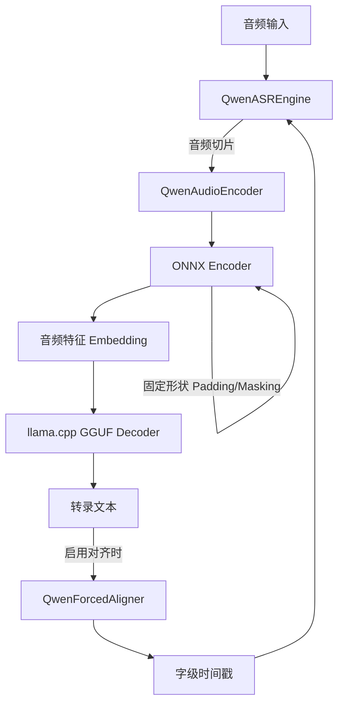

# Qwen3-ASR GGUF

# 基于 原项目 [Qwen3-ASR-GGUF](https://github.com/HaujetZhao/Qwen3-ASR-GGUF) 改造的个人修改版本

# 项目介绍

    将 [Qwen3-ASR](https://www.modelscope.cn/collections/Qwen/Qwen3-ASR) 模型转换为可本地高效运行的混合格式，实现**快速、准确的离线语音识别**。
    主要依赖 [llama.cpp](https://github.com/ggml-org/llama.cpp) 加速 LLM Decoder。
    Qwen3-ASR 0.6B 与 Qwen3-ASR 1.7B 以及 Qwen3-ForceAligner 0.6B 均可用。
    建议使用 1.7B 模型，转写的错误率低很多。

    注意，当前默认是 int8 和 q8_0 量化权重。
    如果要用其它精度，例如 int4，q4_k，需要设定参数 --llm-prec q4_k 和 --enc-prec int4 。
    这将会使用 int4 和 q4 权重的量化权重。
    当前 int8 和 q8_k 量化下，ASR-1.7B + Align-0.6B 权重，llama-cpp-cuda 推理时大约占用 4.5GB 显存 和 4G 内存。

### 命令行

     Usage: transcribe.py [OPTIONS] FILES...                                                                                                                                            
                                                                                                                                                                                        
     使用 Qwen3-ASR GGUF 模型对音频进行高精度转录。                                                                                                                                     
                                                                                                                                                                                        
    ╭─ Arguments ──────────────────────────────────────────────────────────────────────────────────────────────────────────────────────────────────────────────────────────────────────╮
    │ *    files      FILES...  要转录的音频文件列表 [required]                                                                                                                        │
    ╰──────────────────────────────────────────────────────────────────────────────────────────────────────────────────────────────────────────────────────────────────────────────────╯
    ╭─ Options ────────────────────────────────────────────────────────────────────────────────────────────────────────────────────────────────────────────────────────────────────────╮
    │ --help          Show this message and exit.                                                                                                                                      │
    ╰──────────────────────────────────────────────────────────────────────────────────────────────────────────────────────────────────────────────────────────────────────────────────╯
    ╭─ 输入输出 ───────────────────────────────────────────────────────────────────────────────────────────────────────────────────────────────────────────────────────────────────────╮
    │ --output-dir  -o      PATH  输出目录，不设定时，默认输出到源文件所在目录                                                                                                         │
    ╰──────────────────────────────────────────────────────────────────────────────────────────────────────────────────────────────────────────────────────────────────────────────────╯
    ╭─ 模型配置 ───────────────────────────────────────────────────────────────────────────────────────────────────────────────────────────────────────────────────────────────────────╮
    │ --model-dir  -m                 TEXT     模型权重根目录 [default: D:\Data\github_repo\Qwen3-ASR-GGUF\model]                                                                      │
    │ --enc-prec                      TEXT     使用的编码器精度: 可选：fp16 int8 int4 [default: int8]                                                                                  │
    │ --llm-prec                      TEXT     使用的LLM模型精度，可选：f16 q8_0 q6_k q4_k [default: q8_0]                                                                             │
    │ --timestamp      --no-ts                 是否开启时间戳引擎 [default: timestamp]                                                                                                 │
    │ --provider   -p                 TEXT     ONNX 执行后端: CPU, CUDA, DML, TRT [default: DML]                                                                                       │
    │ --gpu            --no-gpu                LLM 是否使用 GPU 加速 [default: gpu]                                                                                                    │
    │ --vulkan         --no-vulkan             是否开启 Vulkan 加速 (设置 GGML_VULKAN=1) [default: vulkan]                                                                             │
    │ --n-ctx                         INTEGER  LLM 上下文窗口大小 [default: 2048]                                                                                                      │
    ╰──────────────────────────────────────────────────────────────────────────────────────────────────────────────────────────────────────────────────────────────────────────────────╯
    ╭─ 转录设置 ───────────────────────────────────────────────────────────────────────────────────────────────────────────────────────────────────────────────────────────────────────╮
    │ --language     -l        TEXT   强制指定语种 (例: Chinese, English)                                                                                                              │
    │ --context      -ctx      TEXT   上下文提示词 (Prompt)                                                                                                                            │
    │ --temperature            FLOAT  采样温度 [default: 0.6]                                                                                                                          │
    ╰──────────────────────────────────────────────────────────────────────────────────────────────────────────────────────────────────────────────────────────────────────────────────╯
    ╭─ 音频切片 ───────────────────────────────────────────────────────────────────────────────────────────────────────────────────────────────────────────────────────────────────────╮
    │ --seek-start  -ss      FLOAT  音频开始位置 (秒) [default: 0.0]                                                                                                                   │
    │ --duration    -t       FLOAT  处理音频的时长 (秒)                                                                                                                                │
    ╰──────────────────────────────────────────────────────────────────────────────────────────────────────────────────────────────────────────────────────────────────────────────────╯
    ╭─ 额外解码设定 ───────────────────────────────────────────────────────────────────────────────────────────────────────────────────────────────────────────────────────────────────╮
    │ --top-k                    INTEGER  仅保留概率最高的top_k个token，其余token概率置零，再重新归一化 [default: 20]                                                                  │
    │ --top-p                    FLOAT    Nucleus Sampling，从概率最高的token开始累加，直到累计概率超过top_p，然后仅在此'核心'集合中采样 [default: 0.95]                               │
    │ --min-p                    FLOAT    相对阈值过滤。移除所有概率低于 max_prob * min_p 的 token（max_prob 是当前最高概率 token 的概率） [default: 0.05]                             │
    │ --repeat-penalty           FLOAT    若 token 已出现在最近的 penalty_last_n 序列中，其logit除以 repeat_penalty [default: 1.0]                                                     │
    │ --frequency-penalty        FLOAT    token 在序列中出现的次数越多，惩罚就越多。logit=logit-frequency_penalty*count [default: 0.02]                                                │
    │ --presence-penalty         FLOAT    当token在序列中出现过一次就施加一个固定惩罚，该惩罚固定的，不会随次数增加而增加。logit=logit-presence_penalty*occurred（occurred为0或1）     │
    │                                     [default: 0.0]                                                                                                                               │
    │ --penalty-last-n           INTEGER  只考虑最近生成的 penalty_last_n 个 token 来计算惩罚 [default: 20]                                                                            │
    ╰──────────────────────────────────────────────────────────────────────────────────────────────────────────────────────────────────────────────────────────────────────────────────╯
    ╭─ 流式配置 ───────────────────────────────────────────────────────────────────────────────────────────────────────────────────────────────────────────────────────────────────────╮
    │ --chunk-size  -c      FLOAT    分段识别时长 (秒) [default: 40.0]                                                                                                                 │
    │ --memory-num          INTEGER  记忆的历史片段数量 [default: 1]                                                                                                                   │
    ╰──────────────────────────────────────────────────────────────────────────────────────────────────────────────────────────────────────────────────────────────────────────────────╯
    ╭─ 其他选项 ───────────────────────────────────────────────────────────────────────────────────────────────────────────────────────────────────────────────────────────────────────╮
    │ --verbose  -v  --quiet  -q    是否打印详细日志 [default: verbose]                                                                                                                │
    ╰──────────────────────────────────────────────────────────────────────────────────────────────────────────────────────────────────────────────────────────────────────────────────╯
    ╭─ 输出控制 ───────────────────────────────────────────────────────────────────────────────────────────────────────────────────────────────────────────────────────────────────────╮
    │ --no-json  -njson        不输出json文件                                                                                                                                          │
    │ --no-srt   -nsrt         不输出srt文件                                                                                                                                           │
    │ --no-txt   -ntxt         不输出txt文件                                                                                                                                           │
    ╰──────────────────────────────────────────────────────────────────────────────────────────────────────────────────────────────────────────────────────────────────────────────────╯
    


### 核心特性

- ✅ **纯本地运行** - 无需网络，数据不外传
- ✅ **速度快** - 混合推理架构 (ONNX Encoder + GGUF Decoder)
- ✅ **GPU 加速** - 支持 Vulkan / DirectML 
- ✅ **流式输出** - 无限时长的音频文件，流式转录
- ✅ **字幕输出** - ForceAligner 对齐字级时间戳，输出 SRT/JSON 格式
- ✅ **上下文增强** - 可提供上下文信息，提升准确率

## 性能表现

1.7B 在 RTX 5050 笔记本上的实测数据（50秒中文音频）：

```
(fun) PS D:\qwen3-asr> python .\transcribe.py .\test.mp3 -y
╭─────── Qwen3-ASR 配置选项 ───────╮
│  模型目录    D:\qwen3-asr\model  │
│  编码精度    int4                │
│  加速设备    DML:ON | Vulkan:ON  │
│  时间戳对齐  启用                │
│  语言设定    自动识别            │
╰──────────────────────────────────╯
--- [QwenASR] 初始化引擎 (DML: True) ---
--- [QwenASR] 辅助进程已就绪 ---
--- [QwenASR] 引擎初始化耗时: 3.61 秒 ---

开始处理: test.mp3

...
你怎么看待两个月之前的判断？
当初的判断不变，
美国对于委内瑞拉的突袭性质依然是政治投机，
不能算是地面战争。
入侵的美国军队总数是一两百，
站在委内瑞拉领土上的时间不超过一个小时，
算是。


📊 性能统计:
  🔹 RTF (实时率) : 0.052 (越小越快)
  🔹 音频时长    : 50.20 秒
  🔹 总处理耗时  : 2.59 秒
  🔹 编码等待    : 0.21 秒
  🔹 对齐总时    : 0.83 秒 (分段异步对齐)
  🔹 LLM 预填充  : 0.420 秒 (1742 tokens, 4149.1 tokens/s)
  🔹 LLM 生成    : 1.670 秒 (191 tokens, 114.4 tokens/s)
✅ 已保存文本文件: test.txt
✅ 已生成字幕文件: test.srt
✅ 已导出时间戳: test.json
```

CPU 的速度：

```
> python .\transcribe.py --no-dml --no-vulkan .\test.mp3 -y
╭──────── Qwen3-ASR 配置选项 ────────╮
│  模型目录    D:\qwen3-asr\model    │
│  编码精度    int4                  │
│  加速设备    DML:OFF | Vulkan:OFF  │
│  时间戳对齐  启用                  │
│  语言设定    自动识别              │
╰────────────────────────────────────╯
--- [QwenASR] 初始化引擎 (DML: False) ---
--- [QwenASR] 辅助进程已就绪 ---
--- [QwenASR] 引擎初始化耗时: 2.75 秒 ---

开始处理: test.mp3

...
你怎么看待两个月之前的判断？
当初的判断不变，
美国对于委内瑞拉的突袭性质依然是政治投机，
不能算是地面战争。
入侵的美国军队总数是一两百，
站在委内瑞拉领土上的时间不超过一个小时，
算是。


📊 性能统计:
  🔹 RTF (实时率) : 0.390 (越小越快)
  🔹 音频时长    : 50.20 秒
  🔹 总处理耗时  : 19.60 秒
  🔹 编码等待    : 0.80 秒
  🔹 对齐总时    : 7.90 秒 (分段异步对齐)
  🔹 LLM 预填充  : 10.742 秒 (1741 tokens, 162.1 tokens/s)
  🔹 LLM 生成    : 7.009 秒 (190 tokens, 27.1 tokens/s)   
✅ 已保存文本文件: test.txt
✅ 已生成字幕文件: test.srt
✅ 已导出时间戳: test.json
```

## 显存占用

以 1.7B ASR 和 0.6B Aligner 载入为例，Encoder int4 量化，Decoder q4_k 量化。

开启 DML 时：

- ASR Encoder     占用显存 473MB
- Aligner Encoder 占用显存 420MB

开启 Vulkan 时：

- ASR Decoder     模型占用显存 1064MB，上下文占用显存 228 MB，推理占用 304MB，总共 1.6GB
- Aligner Decoder 模型占用显存  372MB，上下文占用显存 228 MB，推理占用 299MB，总共 0.9GB

所以开启 DML 需备足 900M 显存，开启 Vulkan 需备足 2.5G 显存。


## 快速开始

### 1. 安装依赖

```shell
pip install requirements.txt
```

> 依赖可能写得不是那么全，缺啥就装啥呗，没有需要自己编译的

从 [llama.cpp Releases](https://github.com/ggml-org/llama.cpp/releases) 下载预编译二进制，将 里面的 EXE 和 DLL 放入 `llama_bin` 文件夹中：

| 平台 | 下载文件 |
|------|----------|
| **Windows** | `llama-bXXXX-bin-win-vulkan-x64.zip` |

### 2. 下载模型


#### 2.0 量化权重放置的位置

model/qwen3_asr_llm.q8_0.gguf
model/qwen3_asr_encoder_frontend.int8
model/qwen3_asr_encoder_backend.int8.onnx
model/qwen3_aligner_llm.q8_0.gguf
model/qwen3_aligner_encoder_frontend.int8.onnx
model/qwen3_aligner_encoder_backend.int8.onnx

其中 qwen3_asr_ 开头的，可以是 0.6B 或 1.7B 的ASR模型，它们名字相同。
qwen3_aligner_ 开头的，是 0.6B 的对齐模型。

#### 2.1 下载现成的量化权重

到 [Models Release](https://github.com/HaujetZhao/Qwen3-ASR-GGUF/releases/tag/models) 下载已经转换好的模型打包文件，下载后解压到 `model` 文件夹。

ASR 模型有 0.6B 和 1.7B 的，后者精度更高，但慢些。

Aligner 模型是 0.6B 的。

为节约显存，打包的模型：

- Encoder 全部 int4 量化，与 fp16 输出的数值余弦相似度 96%
- Decoder 全部 q4_k 量化，比 fp16 输出的困惑度仅增加 8.7%

对于语音识别，量化带来的精度差异小到可以忽略。

如果执意要用其它精度（fp32、fp16、int8）可以自行手动导出。


#### 2.2 手动导出量化权重

下载原始模型：

```shell
pip install modelscope
modelscope download --model Qwen/Qwen3-ASR-0.6B --local_dir Qwen3-ASR-0.6B
modelscope download --model Qwen/Qwen3-ForcedAligner-0.6B --local_dir Qwen3-ForcedAligner-0.6B
```

修改文件 `export_config.py`，填入下载官方模型路径：
ASR_MODEL_DIR 填入 Qwen3-ASR-0.6B 的本地路径
ALIGNER_MODEL_DIR 填入 Qwen3-ForcedAligner-0.6B 的本地路径
EXPORT_DIR 填入导出模型的路径，建议保持默认

LLM_QUANTIZE_TYPE 填入要量化的类型，建议是 q8_0
ENC_QUANTIZE_TYPE 填入要量化的类型，建议是 int8

```python
from pathlib import Path
model_home = Path('~/.cache/modelscope/hub/models/Qwen').expanduser()

# [源模型路径] 官方下载好的 SafeTensors 模型文件夹
ASR_MODEL_DIR =  r'E:\LLM\Model\Qwen3-ASR-0.6B'
ALIGNER_MODEL_DIR =  r'E:\LLM\Model\Qwen3-ForcedAligner-0.6B'

# [导出目标路径] 转换后的 ONNX, GGUF 和权重汇总目录
EXPORT_DIR = r'./model'

```

导出模型：

```shell
# === 1. ASR 模型导出流程 ===
python 01-Export-ASR-Encoder-Frontend.py     # 导出 Encoder 前段 (CNN)
python 02-Export_ASR-Encoder-Backend.py      # 导出 Encoder 后段 (Transformer)
python 03-Optimize-ASR-Encoder.py            # 优化 ONNX 模型
python 04-Quantize-ASR-Encoder.py            # 编码器量化 (FP16/INT8/INT4)
python 05-Export-ASR-Decoder-HF.py           # 提取 Decoder 权重
python 06-Convert-ASR-Decoder-GGUF.py        # 转为 GGUF 格式 (FP16)
python 07-Quantize-ASR-Decoder-GGUF.py       # GGUF 二次量化 (Q4_K)

# === 2. Aligner 模型导出流程 ===
python 11-Export-Aligner-Encoder-Frontend.py
python 12-Export-Aligner-Encoder-Backend.py
python 13-Optimize-Aligner-Encoder.py
python 14-Quantize-Aligner-Encoder.py
python 15-Export-Aligner-Decoder-HF.py
python 16-Convert-Aligner-Decoder-GGUF.py
python 17-Quantize-Aligner-Decoder-GGUF.py
```

### 3. 转录测试

推荐使用 `transcribe.py` 命令行工具进行转录，支持丰富的参数配置：

```shell
# 基本用法
python transcribe.py test_audio/asr_zh.aac

# 添加参数，如禁用 dml
python transcribe.py test_audio/asr_zh.aac --prec int4 --no-dml --no-vulkan --n-ctx 4096
```

也可以参考 `21-Run-ASR.py` 在 Python 代码中调用：

```shell
python 21-Run-ASR.py
```

部分代码解析：

```python
# 配置引擎
config = ASREngineConfig(
    model_dir="model", 
    use_dml = True, 
    encoder_frontend_fn = "qwen3_asr_encoder_frontend.int4.onnx",
    encoder_backend_fn = "qwen3_asr_encoder_backend.int4.onnx",
    enable_aligner = True, 
    align_config = AlignerConfig(
        use_dml=True, 
        model_dir="model", 
        encoder_frontend_fn = "qwen3_aligner_encoder_frontend.int4.onnx",
        encoder_backend_fn = "qwen3_aligner_encoder_backend.int4.onnx"
    )
)

# 初始化引擎
engine = QwenASREngine(config=config)

# 媒体文件，可以音频也可以是视频
audio_path = 'test_audio/asr_zh.aac'
# 上下文提示，可以提示模型这段音频是什么类型的，例如：这是一个播客的音频，或者这是一个会议的音频等
context = '这是一个播客的音频'

# 执行转录
res = engine.transcribe(
    audio_file=audio_path,  
    context=context,
    language="Chinese",   # 强制指定语言 (如 'Chinese', 'English', None)
    start_second=0,       # 从何处开始读音频
    duration=None         # 读取多长音频，None 表示全部读取
)

```

项目采用**纯同步顺序执行**架构，得益于 Encoder 在开启 DirectML 后的极速表现（30s 音频仅需约 0.04s），现已移除复杂的多进程异步流水线，简化为：



- **同步执行**: `编码 -> LLM 推理 -> 对齐` 顺序完成，代码更简洁，RTF 依然保持领先。
- **DML 形状固定优化**: 推理时将音频填充（Padding）到固定长度（如 40s），并配合 Attention Mask。这解决了 DirectML 在处理动态形状时频繁分配显存导致的性能抖动，显著提升了推理速度。


## 如何构建转录程序 transcribe.py 独立可执行文件

运行以下命令即可，构建完成的可执行文件会在 `dist/` 目录下。

pyinstaller .\transcribe.spec

## 项目结构

```bash
├── 01-Export-ASR-Encoder-Frontend.py        # 导出 ASR 编码器前段 (CNN)
├── 02-Export_ASR-Encoder-Backend.py         # 导出 ASR 编码器后段 (Transformer)
├── 03-Optimize-ASR-Encoder.py               # 优化 ASR 编码器 (融合常量、折叠算子)
├── 04-Quantize-ASR-Encoder.py               # ASR 编码器量化 (INT8/FP16/INT4)
├── 05-Export-ASR-Decoder-HF.py              # 提取 ASR 解码器权重
├── 06-Convert-ASR-Decoder-GGUF.py           # ASR 解码器转为 GGUF 格式 (FP16)
├── 07-Quantize-ASR-Decoder-GGUF.py          # ASR 解码器 GGUF 量化 (Q4_K)
├── 11-Export-Aligner-Encoder-Frontend.py    # 导出对齐编码器前段
├── 12-Export-Aligner-Encoder-Backend.py     # 导出对齐编码器后段
├── 13-Optimize-Aligner-Encoder.py           # 优化对齐编码器
├── 14-Quantize-Aligner-Encoder.py           # 对齐编码器量化 (INT8/FP16/INT4)
├── 15-Export-Aligner-Decoder-HF.py          # 提取对齐解码器权重
├── 16-Convert-Aligner-Decoder-GGUF.py       # 将对齐解码器转换为 GGUF
├── 17-Quantize-Aligner-Decoder-GGUF.py      # 对齐解码器 GGUF 量化
├── 18-Run-Aligner.py                        # Aligner 对齐 API 示例脚本
├── 21-Run-ASR.py                            # ASR 转录 API 示例脚本
├── transcribe.py                            # 命令行转录工具 (功能最全)
├── build_standalone.bat                     # 构建独立可执行文件 (Windows)
└── qwen_asr_gguf/
    └── inference/
        ├── asr.py                  # ASR 核心引擎逻辑
        ├── aligner.py              # 强行对齐逻辑
        ├── encoder.py              # 音频特征提取逻辑 (ONNX 封装)
        ├── llama.py                # llama.cpp Python 绑定
        ├── exporters.py            # SRT/JSON/TXT 导出工具
        └── chinese_itn.py          # 中文数字规整 (ITN)
```

## 常见问题

**Q: 输出全是乱码或「!!!!」怎么办？**

Intel 集显的 FP16 计算可能溢出，设置环境变量禁用：

```python
os.environ["GGML_VK_DISABLE_F16"] = "1"
```


---

## 致谢

- [Qwen3-ASR-GGUF](https://github.com/HaujetZhao/Qwen3-ASR-GGUF) - 原项目，打通GGUF模型转换和高速推理
- [Qwen3-ASR](https://www.modelscope.cn/collections/Qwen/Qwen3-ASR) - 原始模型
- [llama.cpp](https://github.com/ggml-org/llama.cpp) - GGUF 推理引擎
